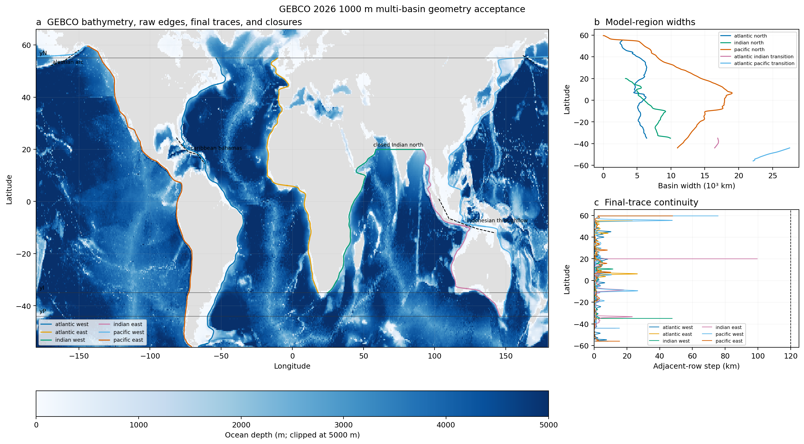

# Production geometry

The production geometry is extracted from the GEBCO 2026 sub-ice grid at the
same 1000 m depth used for the active layer. The result is a
`MultiBasinTopology`: its five basins share six physical boundary traces by
identity, so geometry is not duplicated in a separate container.

The extractor uses xarray and Dask to search a coarsened deep-water mask, but
refines physical crossings against native GEBCO pixels. Named closures prevent
the Indonesian Throughflow, Caribbean passages, and Aleutian passages from
changing the fixed non-ITF connectivity. Each western and eastern boundary is
labelled from a seeded two-dimensional component clipped at its own southern
gateway; a route through the Southern Ocean is therefore impossible.

## Scientific acceptance



The faint dotted curves are the native-refined rowwise component edges. Solid
curves are the continuous, single-valued traces used by the theory; points
requiring closure guidance or branch repair are recorded in the serialized
quality mask. The right panels expose basin widths and every adjacent-row
step, with the 120 km rejection threshold shown as a dashed line.

For the checked GEBCO source, the Indian basin is closed at
\(20^\circ\mathrm{N}\), while its eastern wall is still on Southeast Asia,
rather than after that wall jumps onto India. The independently inferred
Pacific closure is approximately \(59.57^\circ\mathrm{N}\). The Atlantic
limit remains the prescribed \(55^\circ\mathrm{N}\). The full-data acceptance
test also requires:

- every final sample to be finite inside its declared interval;
- no adjacent-row boundary step above 120 km;
- 90% of model-ready samples to lie within 60 km of a native 1000 m crossing;
- fewer than 3% of rows to lack a native crossing within a 3 degree audit
  window, which explicitly identifies the short intervals where a smooth
  single-valued boundary bridges a geographic branch change.

The NetCDF output preserves both raw and final longitudes, repaired flags,
closure routes, all extraction and regularization parameters, GEBCO identity
and checksum, package version, creation time, and per-trace audit statistics.

## Reproduce the review

Set `MOC_GEBCO_FILE` to the local GEBCO file to run the opt-in production gate:

```console
MOC_GEBCO_FILE=/path/to/GEBCO_2026_sub_ice.nc pytest -m integration
```

After serializing a topology with `topology_to_dataset`, rebuild the figure:

```console
python scripts/plot_geometry_acceptance.py geometry.nc \
    /path/to/GEBCO_2026_sub_ice.nc geometry-acceptance.png
```

## Extraction API

::: moc_adjustment_theory.gebco.extract_boundary_traces
    options:
      show_root_heading: true
      show_source: false

::: moc_adjustment_theory.gebco.topology_from_gebco
    options:
      show_root_heading: true
      show_source: false

## Serialization API

::: moc_adjustment_theory.geometry_io.topology_to_dataset
    options:
      show_root_heading: true
      show_source: false

::: moc_adjustment_theory.geometry_io.topology_from_dataset
    options:
      show_root_heading: true
      show_source: false
