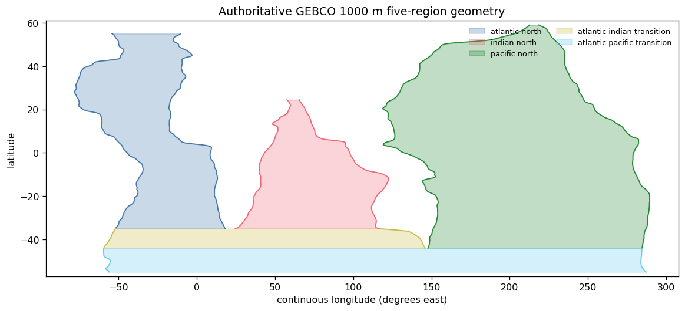
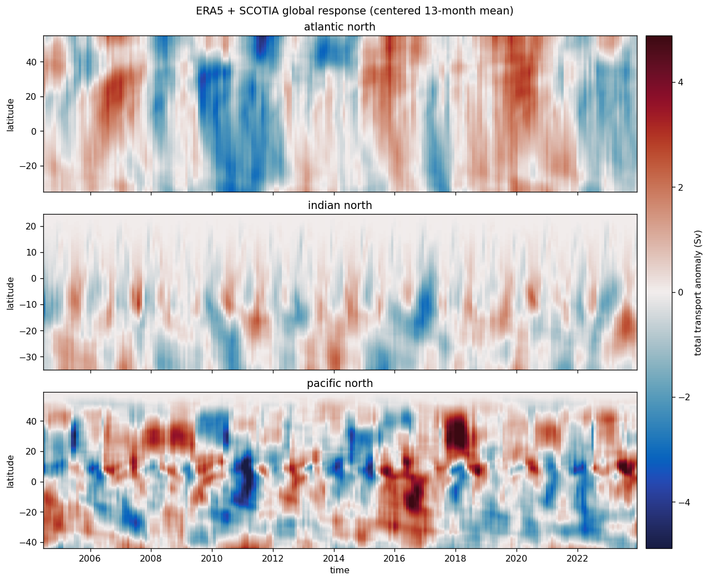
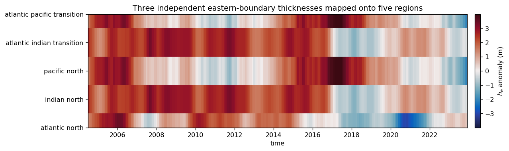
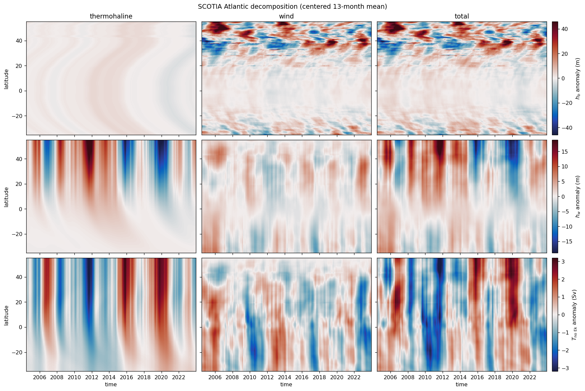
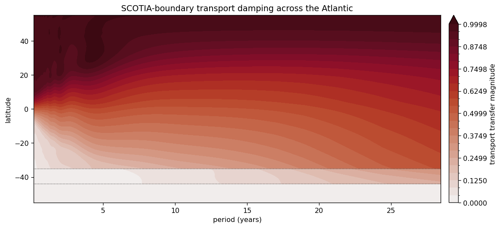

# Global ERA5 + SCOTIA adjustment

This is the single worked example for the package. It uses the authoritative
five-region global geometry and reproduces the established Atlantic
wind/thermohaline decomposition within the same global solve.

**Geometry.** Six GEBCO 1000 m traces define the five regions. The theory
stops at $55^\circ$S; the Atlantic closes at $55^\circ$N, the Indian at
$24.5^\circ$N, and the Pacific at $59^\circ$N.

**Forcing.** ERA5 wind-stress anomalies are converted upstream to vector
Ekman transport $\mathbf{M}_{\mathrm{Ek}}$. SCOTIA supplies the total
northern transport. The southern transport and every internal Ekman section
are derived from the same $\mathbf{M}_{\mathrm{Ek}}$.

**Decomposition.** The total run uses SCOTIA at the northern boundary. The
wind run replaces it with the northern Ekman section; total minus wind is the
thermohaline component. Linearity closes the three components to roundoff.

Here $h_b$ is evaluated at $x_b$, outside the western boundary-current region,
and $h_w$ is the western-boundary thickness. The transport decomposition uses
the legacy $T_{\mathrm{no\ Ek}}$ convention, i.e. geostrophic transport.
Only Hovmöller and contour diagnostics are shown; no spectra or line banks.


```python
from pathlib import Path
import os
import sys
import warnings

import cmocean
import dask
from dask.array.core import PerformanceWarning
import matplotlib.colors as mcolors
import matplotlib.pyplot as plt
import numpy as np
import xarray as xr

REPO = Path.cwd().parent if Path.cwd().name == "notebooks" else Path.cwd()
sys.path.insert(0, str(REPO / "src"))
sys.path.insert(0, str(REPO / "notebooks"))
DATA_ROOT = Path(os.environ["MOC_EXAMPLE_DATA_ROOT"])

from moc_adjustment_theory import GlobalAdjustmentModel, GlobalForcing
from _example_helpers import (
    ekman_transport_from_stress,
    global_geometry,
    plot_geometry,
    regularization_gamma,
    section_transport,
    stitched_atlantic,
)

plt.rcParams.update({"figure.dpi": 115, "axes.grid": False})
warnings.filterwarnings("ignore", category=PerformanceWarning)
```

## Geometry and observed northern forcing


```python
scotia = xr.open_dataset(
    DATA_ROOT / "SCOTIA/SCOTIA_overturning_diagnostics.nc"
).moc
scotia = scotia.assign_coords(time=scotia.time - np.timedelta64(14, "D"))
scotia.attrs["units"] = "Sv"

isobaths = xr.open_dataset(
    REPO / "data/tracked/isobath/global_isobath_GEBCO_1000m.nc"
).dropna("latitude", how="all")

def common_support(*names):
    traces = [isobaths[name].dropna("latitude") for name in names]
    return (
        max(float(trace.latitude[0]) for trace in traces),
        min(float(trace.latitude[-1]) for trace in traces),
    )

y_I, _ = common_support("x_wI", "x_eI")
y_P, _ = common_support("x_wP", "x_eP")
y_S, y_N, y_NI, y_NP = -55.0, 55.0, 24.5, 59.0
geometry = global_geometry(
    isobaths,
    y_S=y_S,
    y_P=y_P,
    y_I=y_I,
    y_N=y_N,
    y_NI=y_NI,
    y_NP=y_NP,
)

fig, ax = plt.subplots(figsize=(10, 4.5), constrained_layout=True)
plot_geometry(geometry, ax=ax)
ax.set(
    title="Authoritative GEBCO 1000 m five-region geometry",
    ylim=(y_S - 2, y_NP + 2),
)
plt.show()

print(
    f"SCOTIA record: {str(scotia.time.values[0])[:10]} to "
    f"{str(scotia.time.values[-1])[:10]} ({scotia.sizes['time']} months)"
)
print(
    f"gateways: y_P={y_P:.2f}, y_I={y_I:.2f}; "
    f"closures: y_S={y_S:g}, y_N={y_N:g}, y_NI={y_NI:g}, y_NP={y_NP:g}"
)
```


    

    


    SCOTIA record: 2004-01-01 to 2024-06-01 (246 months)
    gateways: y_P=-43.99, y_I=-34.99; closures: y_S=-55, y_N=55, y_NI=24.5, y_NP=59


## ERA5 anomalies and the two linear model runs

Reference density and equatorial regularization are explicit upstream
choices. No discontinuous domain mask is applied: the geometry limits the
regional model integrals. The package receives only the resulting vector
Ekman transport and boundary transports.


```python
winds = xr.open_dataset(
    DATA_ROOT / "ERA5/global_winds.nc",
    chunks={},
)[["avg_iews", "avg_inss"]]
winds = winds.assign_coords(
    valid_time=winds.valid_time - np.timedelta64(6, "h")
).rename(valid_time="time")
winds = winds.sel(latitude=slice(y_NP, y_S)).sortby("latitude")
winds = winds.sel(time=scotia.time).chunk(
    {"time": -1, "latitude": 24, "longitude": 96}
)
stress_anomaly = winds - winds.mean("time")

rho_0 = 1027.0  # explicitly upstream
g_prime = 0.02
gamma = regularization_gamma(g_prime, geometry.H)
M_ek = ekman_transport_from_stress(
    stress_anomaly,
    geometry,
    rho_0=rho_0,
    gamma=gamma,
    width_degrees=None,
)
T_ek_north = section_transport(
    M_ek.M_ek_y,
    geometry,
    region="atlantic_north",
    latitude=y_N,
)
T_ek_south = section_transport(
    M_ek.M_ek_y,
    geometry,
    region="atlantic_pacific_transition",
    latitude=y_S,
)

def solve(northern_transport, southern_transport):
    forcing = GlobalForcing.from_time_series(
        M_ek_x=M_ek.M_ek_x,
        M_ek_y=M_ek.M_ek_y,
        northern_transport=northern_transport,
        southern_transport=southern_transport,
        sample_interval_seconds=365.25 * 86_400 / 12,
        padding_samples=scotia.sizes["time"] - 1,
        n_fft=2048,
    )
    output = GlobalAdjustmentModel(geometry, forcing, g_prime=g_prime).solve()
    return forcing, output

with dask.config.set(scheduler="threads", num_workers=2):
    total_forcing, total_output = solve(scotia, T_ek_south)
    wind_forcing, wind_output = solve(T_ek_north, T_ek_south)

thermohaline = total_output.dataset - wind_output.dataset
components = {
    "thermohaline": thermohaline,
    "wind": wind_output.dataset,
    "total": total_output.dataset,
}
```

## Basin-resolved global response


```python
window_months = 13
regions = ["atlantic_north", "indian_north", "pacific_north"]
fields = [
    (total_output.transport.sel(region=region).dropna("latitude", how="all") / 1e6)
    .rolling(time=window_months, center=True).mean().dropna("time")
    for region in regions
]
vmax = max(float(abs(field).quantile(0.995)) for field in fields)
norm = mcolors.TwoSlopeNorm(vmin=-vmax, vcenter=0.0, vmax=vmax)

fig, axes = plt.subplots(3, 1, figsize=(11, 9), sharex=True, constrained_layout=True)
for ax, region, field in zip(axes, regions, fields):
    mesh = field.plot.pcolormesh(
        ax=ax,
        x="time",
        y="latitude",
        cmap=cmocean.cm.balance,
        norm=norm,
        add_colorbar=False,
        rasterized=True,
    )
    ax.set(ylabel="latitude", xlabel="", title=region.replace("_", " "))
fig.colorbar(mesh, ax=axes, pad=0.015, label="total transport anomaly (Sv)")
axes[-1].set_xlabel("time")
fig.suptitle(
    f"ERA5 + SCOTIA global response (centered {window_months}-month mean)"
)
plt.show()

he = total_output.h_e.rolling(time=window_months, center=True).mean().dropna("time")
he = he.assign_coords(
    region=[str(region).replace("_", " ") for region in he.region.values]
)
fig, ax = plt.subplots(figsize=(11, 3.2), constrained_layout=True)
vmax_h = float(abs(he).quantile(0.995))
mesh = he.transpose("region", "time").plot.pcolormesh(
    ax=ax,
    x="time",
    y="region",
    cmap=cmocean.cm.balance,
    norm=mcolors.TwoSlopeNorm(vmin=-vmax_h, vcenter=0.0, vmax=vmax_h),
    add_colorbar=False,
)
fig.colorbar(mesh, ax=ax, pad=0.02, label=r"$h_e$ anomaly (m)")
ax.set(
    title="Three independent eastern-boundary thicknesses mapped onto five regions",
    xlabel="time",
    ylabel="",
)
plt.show()
```


    

    


    

    


## Wind-compatibility diagnostic

This inexpensive residual checks the finite-grid divergence theorem. It is
reported rather than imposed as another forcing constraint; it includes
differentiation/integration error and boundary-adjacent discretization.


```python
compatibility = total_output.dataset.compatibility_residual / 1e6
section_imbalance = []
for region in total_output.transport_ekman.region.values:
    profile = total_output.transport_ekman.sel(region=region).dropna(
        "latitude", how="all"
    ) / 1e6
    section_imbalance.append(profile.isel(latitude=-1) - profile.isel(latitude=0))
section_imbalance = xr.concat(
    section_imbalance,
    dim=xr.IndexVariable("region", total_output.transport_ekman.region.values),
)
pumping_integral = compatibility + section_imbalance
rms_residual = np.sqrt((compatibility**2).mean("time"))
rms_reference = xr.apply_ufunc(
    np.maximum,
    np.sqrt((pumping_integral**2).mean("time")),
    np.sqrt((section_imbalance**2).mean("time")),
)
summary = xr.Dataset(
    {
        "rms_Sv": rms_residual,
        "max_abs_Sv": abs(compatibility).max("time"),
        "rms_fraction": rms_residual / rms_reference,
    }
)
print(summary.to_dataframe().round(3).to_string())
```

                                 rms_Sv  max_abs_Sv  rms_fraction
    region                                                       
    atlantic_north                2.887       7.153         0.742
    indian_north                  9.972      21.234         0.719
    pacific_north                 3.295       9.418         0.668
    atlantic_indian_transition    1.932       5.431         0.380
    atlantic_pacific_transition   0.405       1.259         0.042


## Cape Agulhas-to-SPNA decomposition


```python
def atlantic_field(dataset, name):
    field = dataset[name].sel(region="atlantic_north").dropna(
        "latitude", how="all"
    )
    if name.startswith("transport"):
        field = field / 1e6
    return field.rolling(time=window_months, center=True).mean().dropna("time")

field_specs = [
    ("h_b", r"$h_b$ anomaly (m)"),
    ("h_w", r"$h_w$ anomaly (m)"),
    ("transport_geostrophic", r"$T_{\mathrm{no\ Ek}}$ anomaly (Sv)"),
]
component_names = list(components)
fig, axes = plt.subplots(
    3,
    3,
    figsize=(15, 10),
    sharex=True,
    sharey="row",
    constrained_layout=True,
)
for row, (field_name, colorbar_label) in enumerate(field_specs):
    row_fields = [
        atlantic_field(components[component], field_name)
        for component in component_names
    ]
    vmax = max(float(abs(field).quantile(0.995)) for field in row_fields)
    norm = mcolors.TwoSlopeNorm(vmin=-vmax, vcenter=0.0, vmax=vmax)
    for column, (component, field) in enumerate(zip(component_names, row_fields)):
        ax = axes[row, column]
        mesh = field.plot.pcolormesh(
            ax=ax,
            x="time",
            y="latitude",
            cmap=cmocean.cm.balance,
            norm=norm,
            add_colorbar=False,
            rasterized=True,
        )
        ax.set(xlabel="", ylabel="latitude" if column == 0 else "", title="")
        if row == 0:
            ax.set_title(component)
    fig.colorbar(mesh, ax=axes[row, :], pad=0.01, label=colorbar_label)
for ax in axes[-1, :]:
    ax.set_xlabel("time")
fig.suptitle(
    f"SCOTIA Atlantic decomposition (centered {window_months}-month mean)"
)
plt.show()
```


    

    


## Northern-boundary damping factor

Subtracting the wind run isolates the response to SCOTIA minus the local
northern Ekman section. Dividing that response by the same boundary forcing
gives the transport transfer amplitude without plotting a forcing spectrum.


```python
response = stitched_atlantic(
    total_output.spectral.transport - wind_output.spectral.transport,
    geometry,
).isel(omega=slice(1, None))
source = (
    total_forcing.spectral.northern_transport
    - wind_forcing.spectral.northern_transport
).isel(omega=slice(1, None))
valid = abs(source) > float(abs(source).max()) * 1e-10
period_years = (
    2 * np.pi / response.omega / (365.25 * 86_400)
).rename("period_years")
damping = abs(response / source).where(valid).assign_coords(
    period_years=period_years
)
damping = damping.swap_dims({"omega": "period_years"}).sortby("period_years")
damping = damping.sel(period_years=slice(0.0, 30.0))

fig, ax = plt.subplots(figsize=(10, 4.5), constrained_layout=True)
levels = np.linspace(0.0, float(damping.quantile(0.99)), 25)
mesh = damping.plot.contourf(
    ax=ax,
    x="period_years",
    y="latitude",
    levels=levels,
    cmap=cmocean.cm.amp,
    extend="max",
    add_colorbar=False,
)
fig.colorbar(mesh, ax=ax, pad=0.02, label="transport transfer magnitude")
ax.axhline(y_P, color="0.2", linestyle=":", linewidth=0.8)
ax.axhline(y_I, color="0.2", linestyle=":", linewidth=0.8)
ax.set(
    xlabel="period (years)",
    ylabel="latitude",
    title="SCOTIA-boundary transport damping across the Atlantic",
)
plt.show()
```


    

    


## Linearity check


```python
closure = {}
for name in ("h_b", "h_w", "transport_geostrophic"):
    reconstructed = thermohaline[name] + wind_output.dataset[name]
    closure[name] = float(abs(total_output.dataset[name] - reconstructed).max())
units = {"h_b": "m", "h_w": "m", "transport_geostrophic": "m3 s-1"}
print("maximum absolute closure error")
for name, value in closure.items():
    print(f"  {name:22s} {value:.3e} {units[name]}")
```

    maximum absolute closure error
      h_b                    8.882e-16 m
      h_w                    7.105e-15 m
      transport_geostrophic  1.863e-09 m3 s-1

