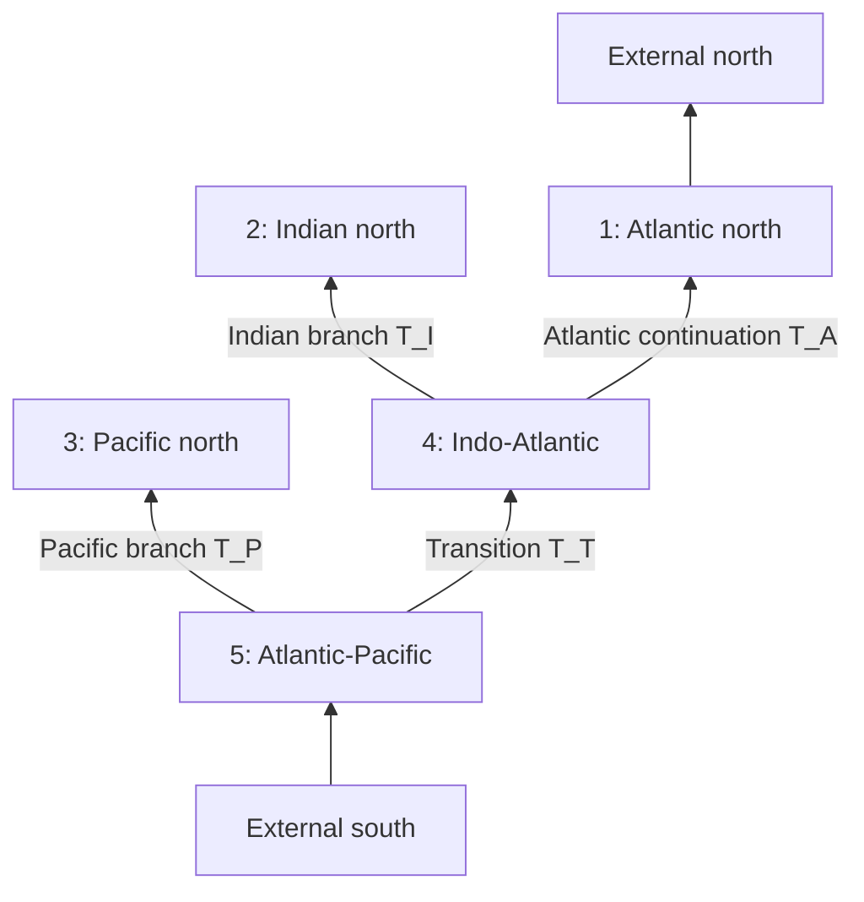

# Model architecture specification

Status: proposed architecture for review. This document specifies interfaces,
equations, invariants, and acceptance tests; it does not authorize scientific
implementation yet.

## 1. Scope and design stance

The first scientific release will support two deliberate model facades:

1. `GlobalNoITFModel`, representing three physical oceans as the five
   dynamical regions in the non-Indonesian-Throughflow derivation.
2. `AtlanticOnlyModel`, representing the single Atlantic region from Cape
   Agulhas to the northern observing line.

They will share geometry, wind, Fourier, response-kernel, solving, and
diagnostic components. They will not initially expose an unrestricted graph
compiler. The global graph is scientifically fixed enough that accepting
arbitrary topologies would add validation burden before there is a tested use
case. Internal graph objects will nevertheless make the five-region structure
explicit, preserve child order, and leave a path to later generalization.

The central separation is:

```text
source data -> validated geometry and forcings -> frequency operators
            -> model-specific linear system -> labelled solution diagnostics
```

Geometry contains no forcing. Forcing contains no solved state. Model facades
own the model-specific equations and compile them in response to typed forcing
prescriptions. Diagnostics derive from one solved state and the same operators
used in the solve.

## 2. Terminology and sign conventions

These terms are normative.

- A **physical ocean** is the Atlantic, Indian, or Pacific.
- A **region** is one of the five latitude-bounded dynamical domains used by
  the global equations. The global model has three physical oceans but five
  regions.
- `x_w(y)` and `x_e(y)` are the six source bathymetric western and eastern
  shelf/isobath traces.
- `x_b(y)` is the offshore, interior edge of the unresolved western boundary
  current (WBC) region. It is physically distinct from `x_w`, even when a thin
  WBC approximation uses `x_b approximately x_w`.
- `h_e` is the eastern-boundary active-layer thickness anomaly.
- `h_b = h(x_b, y, t)` is the interior thickness immediately outside the WBC
  region, obtained from the Rossby-characteristic solution. It is not the
  thickness at the western wall.
- `h_w` is the thickness at the western boundary inferred from geostrophic
  transport. It is not a "westward-propagating thickness."
- `T` is total northward transport and `T_tilde = T - T_Ek` is non-Ekman
  northward transport.
- Graph arrows and positive connection transports point northward.
- Longitude and latitude are degrees east and degrees north at public
  boundaries. Metric integrals use radians and spherical scale factors.
- The Fourier convention is NumPy's forward convention,
  `a_hat(omega) = integral a(t) exp(-i omega t) dt`; a delay `tau` therefore
  contributes `exp(-i omega tau)`.

The relations

$$
T = \widetilde T + T_{Ek},
\qquad
\widetilde T = \frac{g'H}{f}(h_e-h_w),
\qquad
h_w = h_e-\frac{f\widetilde T}{g'H}
$$

must hold under the documented sign convention.

## 3. The non-ITF five-region model

Let the junction latitudes satisfy

$$y_S < y_P < y_I < y_N.$$

The initial values used in the source work are approximately `y_S=-56`,
`y_P=-44`, `y_I=-35`, and `y_N=55` degrees north, but these are explicit
configuration values rather than hard-coded constants.

| ID | Public key | Latitude domain | Western trace | Eastern trace |
|---:|---|---|---|---|
| 1 | `atlantic_north` | `y_I` to `y_N` | Atlantic west | Atlantic east |
| 2 | `indian_north` | `y_I` to `y_NI` | Indian west | Indian east |
| 3 | `pacific_north` | `y_P` to `y_NP` | Pacific west | Pacific east |
| 4 | `indo_atlantic` | `y_P` to `y_I` | Atlantic west | Indian east |
| 5 | `atlantic_pacific` | `y_S` to `y_P` | Atlantic west | Pacific east |

Regions are views assembled from six shared physical traces, not five
independently extracted contours. `y_NI` and `y_NP` are the northern limits of
the closed Indian and Pacific regions and may differ from `y_N`.

Configuration distinguishes a requested physical boundary from its sampled
model-grid boundary. A region's usable domain is the intersection of its
requested interval and the finite coverage of its west, `x_b`, and east
traces. Shared gateways must remain common to parent and children within a
reviewed tolerance; otherwise geometry validation fails. At an outer closure,
the forcing adapter may use the first or last included wind-grid row and
records both latitudes. This makes a change from one valid isobath product to
another robust to sub-grid endpoint differences without silently moving an
internal gateway.

### 3.1 Directed topology



The required east-to-west child orders are:

- region 5: `[pacific_north, indo_atlantic]`;
- region 4: `[indian_north, atlantic_north]`.

The first child is the eastern child and shares its eastern-boundary thickness
with its parent. Consequently there are three independent eastern-boundary
unknowns:

- `h_A` for region 1;
- `h_I` shared by regions 2 and 4;
- `h_P` shared by regions 3 and 5.

The decomposed branch transports are

$$
T_I=T_{I,Ek}+\kappa_I(h_I-h_A),
\qquad
T_P=T_{P,Ek}+\kappa_P(h_P-h_I),
$$

where

$$
\kappa_I=\frac{g'H}{f(y_I)},
\qquad
\kappa_P=\frac{g'H}{f(y_P)}.
$$

The signed Coriolis parameter is required; replacing it with `abs(f)` is an
error. `T_A` and `T_T` are auxiliary continuation transports determined by
regional volume budgets.

Region 1 has the prescribed northern transport. Regions 2 and 3 have solid
northern boundaries. The global southern transport is wind-driven in the
total-transport formulation and zero after consistent conversion to the
non-Ekman formulation.

### 3.2 Physical-ocean views

A physical ocean is not always a graph node. The global Atlantic diagnostic is
the ordered path

```text
atlantic_pacific -> indo_atlantic -> atlantic_north
```

with branch jumps at `y_P` and `y_I`. This should be represented by an
`OceanPath` or `CompositeOceanView` that references regions and connections.
It must not duplicate state or interpolate blindly across a gateway. Indian
and Pacific views are defined similarly from the graph.

## 4. Atlantic-only model

The Atlantic-only facade uses one region, normally from `-35` to `55` degrees
north, with Atlantic `x_w(y)`, `x_b(y)`, and `x_e(y)` throughout. It has no
step changes and no Indian or Pacific branch transports. Its southern closure
is

$$
h_w(y_S,t)=0,
\qquad
\widetilde T_S(t)=\frac{g'H}{f_S}h_e(t).
$$

This is the boundary condition from which the scalar system in Section 8.3 is
derived; it is not a global-model southern closure applied to one graph node.

It reuses the same trace objects, physical parameters, wind operator, Fourier
plan, and diagnostics as the global model. It has a distinct southern closure
and therefore a distinct model-specific linear system; it should not be
implemented by constructing a malformed one-node instance of the global
five-region equations.

The public configuration switch should be explicit:

```python
global_model = GlobalNoITFModel(geometry=global_geometry, physics=physics)
atlantic_model = AtlanticOnlyModel(
    geometry=global_geometry.atlantic_only(),
    physics=physics,
)
```

## 5. Public forcing contract

### 5.1 Wind input is wind-stress anomaly

The public wind forcing is the pair of wind-stress anomalies
`tau_x_prime(time, latitude, longitude)` and
`tau_y_prime(time, latitude, longitude)`, not `w_Ek`.

A `WindStressAnomaly` validates:

- a common, strictly increasing time coordinate;
- one-dimensional latitude and longitude coordinates with an explicit
  convention. Input may be a cyclic global grid or a monotone unwrapped grid
  that covers the geometry; the wind operator normalizes it to a declared
  continuous working frame;
- dimensions and finite values;
- dynamic (`N m-2`) or kinematic (`m2 s-2`) stress units;
- whether and how the time mean was removed;
- provenance, source record, interpolation, and taper configuration.

The normal preparation path computes the anomaly over the exact common model
record before any curl or transport integral. For a SCOTIA/ERA5 experiment,
this means removing the time mean over their common record while retaining the
seasonal cycle. Precomputed `w_Ek` may be accepted only as an internal cache or
advanced low-level operator input; it is not the primary user interface.

The operator immediately converts dynamic stress to the canonical kinematic
stress

$$
\boldsymbol\tau'_k=\boldsymbol\tau'_{dynamic}/\rho_0.
$$

All equations below use `tau_k` and therefore contain no further factor of
`rho0`. The normalized field and original units are both recorded so a later
operator cannot accidentally divide by density twice.

The wind operator derives, with one shared regularization,

$$
I_\gamma(f)=\frac{f}{f^2+\gamma^2},
$$

$$
\mathbf M'_{Ek}
=\left(
\tau'_{k,y} I_\gamma,
-\tau'_{k,x} I_\gamma
\right),
\qquad
w'_{Ek}=\nabla\cdot\mathbf M'_{Ek},
$$

and

$$
T'_{Ek}(y)
=-\int_{x_w}^{x_e}\tau'_{k,x} I_\gamma\,dx.
$$

Section transport and local Ekman transport use the full section from `x_w`
to `x_e`. Rossby-interior operators use `x_b` to `x_e`. A thin-WBC run may
make those limits numerically equal, but only through the explicit
`x_b = x_w` approximation.

Stress is tapered before taking the curl. It goes to zero on solid lateral
sidewalls and on the closed northern boundaries of the Indian and Pacific.
On a sampled forcing grid, the northern taper reaches zero at the last
included latitude row rather than requiring the physical closure latitude to
be an exact coordinate. The three step-shaped Atlantic regions are
differentiated separately so that topological taper discontinuities do not
create artificial wind-curl sheets.

### 5.2 Independent regional forcing

`RegionForcingSet` contains one replaceable wind-stress prescription for each
of the five global regions. A region may:

- use the default geometry-masked view of one global stress field;
- use a separate stress dataset;
- be scaled for a sensitivity experiment;
- be explicitly set to zero.

The absence of a region prescription is an error unless a named default policy
fills it. This prevents an omitted forcing from being silently treated as
zero. Region masks and tapers belong to the wind operator configuration, not
to the raw stress data.

Regional replaceability does not permit two values for one shared gateway.
Before response operators are evaluated, the forcing set constructs one
canonical composite wind field and one `GatewayWindView` for every shared
face. The default field owns all interfaces. If separate regional datasets or
scalings are supplied, the configuration must either:

1. name the region that owns each gateway value; or
2. demonstrate that both prescriptions agree there within a declared
   tolerance after interpolation, normalization, tapering, and
   regularization.

For the fixed graph, the Indian and Pacific branch-section Ekman transports
are computed once from their northern child-ocean views and reused by every
equation touching that gateway. Incompatible parent and child values are an
error, never averaged silently. This preserves a unique `T_I,Ek` and
`T_P,Ek`.

The discrete wind operator must also satisfy, for each region and using the
same grid, mask, metric, taper, and regularization,

$$
\int_{y_S}^{y_N}p_j\,dy
=T_{Ek,j}(y_N)-T_{Ek,j}(y_S)
$$

to numerical tolerance. This discrete divergence/face-transport identity is
required for cancellation of the explicit `p` terms in the `Q/K` system.

External transport prescriptions are typed as `total` or `non_ekman`. A total
transport is converted using the local Ekman transport derived from the same
wind-stress anomaly field. The conversion and sign are recorded in output
metadata. This is essential for the SCOTIA northern-boundary ambiguity and for
equivalence between the two equation forms below.

`AtlanticOnlyModel` accepts one Atlantic stress prescription and the Atlantic
northern transport. It rejects five-region keys rather than ignoring them.
The two facades may share forcing value objects, but they do not pretend to
have identical forcing schemas.

## 6. Time and Fourier plan

A `FourierPlan` owns all temporal preprocessing so every forcing uses exactly
the same convention:

1. intersect source records and resample onto one uniform time axis;
2. form anomalies on that common interval;
3. reflect `n-1` samples at each end of an `n`-sample record;
4. choose `n_fft >= 3n-2`, with optional additional zero padding;
5. use `omega = 2*pi*rfftfreq(n_fft, d=dt)`;
6. solve nonnegative frequencies;
7. set the zero-frequency anomaly solution to exactly zero;
8. reconstruct with `irfft`, crop the original central interval, and remove
   only floating-point residual means.

Reflection and cropping prevent the periodic FFT assumption from connecting
the first and last observations directly. The plan records original and
padded indices, cadence, reflection length, `n_fft`, and frequency units.

The Nyquist policy must be explicit. Both even and odd padded lengths are
allowed. An even-length plan must prove that the standalone real-valued
Nyquist coefficient and operator projection preserve a real inverse transform;
the coefficient must not be silently dropped. The current operational
prototype uses an even length, while the smallest valid reflected length may
have either parity.

## 7. Region response operators

The shared interior dynamics are

$$
\partial_t h-c(y)\partial_xh=-w_{Ek},
\qquad
c(y)=\min\left(\frac{\beta g'H}{f^2},
\frac{\sqrt{g'H}}{3}\right).
$$

Let `phi_c` be the latitude where the uncapped Rossby speed first reaches the
gravity-wave cap. The default Ekman regularization is tied to the same
transition, `gamma = abs(f(phi_c))`; an override must be explicit in
provenance. For canonical kinematic stress on a sphere,

$$
w'_{Ek}=\frac{1}{R\cos\phi}
\left[
\frac{\partial}{\partial\lambda}
\left(\tau'_{k,y}I_\gamma\right)
-\frac{\partial}{\partial\phi}
\left(\tau'_{k,x}I_\gamma\cos\phi\right)
\right].
$$

The discrete implementation is tested against this expression, including the
metric factors; a Cartesian curl is not an interchangeable approximation.

For region `j`, let

$$
L_j(y)=x_e^{(j)}(y)-x_b^{(j)}(y)>0,
$$

and let `c(y)>0` denote the magnitude of westward long-Rossby-wave speed. Define

$$
P_j(\omega,x,y)
=1-e^{-i\omega(x-x_b^{(j)})/c},
$$

For a finite unresolved WBC strip, define

$$
F_j=-\int_{y_{Sj}}^{y_{Nj}}\left[
\int_{x_w}^{x_b}\widehat w_{Ek,j}\,dx
+\int_{x_b}^{x_e}P_j\widehat w_{Ek,j}\,dx
\right]dy,
$$

$$
r_j=-\int_{y_{Sj}}^{y_{Nj}}
cP_j(\omega,x_e^{(j)},y)\,dy.
$$

The first term in `F_j` vanishes under the named thin-WBC approximation. This
is the precise point at which older formulas using `x_b approximately x_w`
are recovered; the two coordinates remain semantically distinct.

Each regional budget is

$$
T_{out}^{(j)}-T_{in}^{(j)}=-F_j+r_jh_e^{(j)}.
$$

Units are part of the operator contract:

- `F`: `m3 s-1`;
- `r` and `kappa`: `m2 s-1`;
- `h_e`: `m`;
- `r*h_e` and `kappa*h_e`: `m3 s-1`.

Partial north-of-latitude integrals are computed by the same operator and
cached for transport diagnostics. They are not independently reimplemented in
plotting code.

## 8. Global equation systems

### 8.1 Full F/r form: normative derivation

The seven unknowns are

$$
(h_A,h_I,h_P,T_A,T_T,T_I,T_P).
$$

Five regional budgets and the two branch decompositions give seven equations.
After eliminating transports, the three-thickness system is

$$
\begin{pmatrix}
r_1+\kappa_I&r_4+\kappa_P-\kappa_I&r_5-\kappa_P\\
-\kappa_I&r_2+\kappa_I&0\\
0&-\kappa_P&r_3+\kappa_P
\end{pmatrix}
\begin{pmatrix}h_A\\h_I\\h_P\end{pmatrix}
=
\begin{pmatrix}
F_1+F_4+F_5+T_N+T_{I,Ek}+T_{P,Ek}-T_S\\
F_2-T_{I,Ek}\\
F_3-T_{P,Ek}
\end{pmatrix}.
$$

The implementation must reproduce this matrix up to a declared permutation.
It is a normative reference, not by itself an independent oracle if both forms
reuse the same operator code. Independent acceptance evaluates the solved
state against the separately assembled seven unreduced regional-budget and
branch-decomposition residuals.

### 8.2 Q/K form: recommended production system

Define

$$
K_j(y,\omega)=c(y)\left[1-e^{-i\omega L_j(y)/c(y)}\right],
$$

$$
p_j(y,\omega)=\int_{x_w^{(j)}}^{x_e^{(j)}}
\widehat w_{Ek,j}\,dx,
$$

$$
q_j(y,\omega)=\int_{x_b^{(j)}}^{x_e^{(j)}}
\widehat w_{Ek,j}e^{-i\omega(x-x_b^{(j)})/c}\,dx.
$$

Thus `p` is the full-section pumping integral consistent with local Ekman
transport, while `q` is the phase-weighted Rossby-interior integral. When
`x_b != x_w`, the WBC-strip contribution retained in `F` is also retained in
the unreduced regional budgets.

When local Ekman transports and pumping derive from the same stress anomaly,
the explicit `p` terms cancel in the non-Ekman transport system. In unknown
order `(h_P, h_I, h_A)`, the production matrix is

$$
\begin{pmatrix}
\kappa_P-\int_3K_Pdy&-\kappa_P&0\\
0&\kappa_I-\int_2K_Idy&-\kappa_I\\
-\kappa_P-\int_5K_Ady&
\kappa_P-\kappa_I-\int_4K_Ady&
\kappa_I-\int_1K_Ady
\end{pmatrix}
\begin{pmatrix}h_P\\h_I\\h_A\end{pmatrix}
=
\begin{pmatrix}
Q_P\\Q_I\\\widetilde T_N+Q_A
\end{pmatrix},
$$

where

$$
Q_P=\int_3q_Pdy,
\quad
Q_I=\int_2q_Idy,
\quad
Q_A=\int_{1\cup4\cup5}q_Ady.
$$

The first implementation should solve this explicit three-by-three system per
frequency, report rank and condition number, and reconstruct all auxiliary
graph transports afterward. A generic equation compiler is unnecessary for
the initial fixed global model.

### 8.3 Atlantic-only system

Applying `h_w(y_S)=0`, and hence
`T_tilde_S = g_prime*H*h_e/f_S`, gives the following scalar system.

For total northern transport,

$$
\left[
\frac{g'H}{f_S}-\int_{y_S}^{y_N}K\,dy
\right]\widehat h_e
=\widehat T_N-\widehat T_{Ek,S}
-\int_{y_S}^{y_N}(\widehat p-\widehat q)\,dy.
$$

Using non-Ekman northern transport gives the equivalent form

$$
\left[
\frac{g'H}{f_S}-\int K\,dy
\right]\widehat h_e
=\widehat{\widetilde T}_N+\int\widehat q\,dy.
$$

The Atlantic facade uses this scalar operator, rather than routing through the
global three-thickness matrix.

## 9. Diagnostics and solution contract

The interior characteristic solution is

$$
\widehat h(x,y)
=\widehat h_e e^{i\omega(x-x_e)/c}
+\int_{x_e}^{x}\frac{\widehat w_{Ek}(x')}{c}
e^{i\omega(x-x')/c}\,dx'.
$$

At the interior edge of the WBC region,

$$
\widehat h_b
=\widehat h_e e^{-i\omega L/c}-\frac{\widehat q}{c}.
$$

For the global Atlantic path, the applicable eastern thickness is

$$
h_e^*(y)=
\begin{cases}
h_A,&y\ge y_I,\\
h_I,&y_P\le y<y_I,\\
h_P,&y<y_P.
\end{cases}
$$

The path's non-Ekman transport is

$$
\widetilde T_A(y)
=\widetilde T_N
+\int_y^{y_N}\left[q_A+K_Ah_e^*\right]dy'
+\mathbf 1_{y<y_I}T_{I,g}
+\mathbf 1_{y<y_P}T_{P,g},
$$

where

$$
T_{I,g}=\kappa_I(h_I-h_A),
\qquad
T_{P,g}=\kappa_P(h_P-h_I).
$$

The Indian and Pacific physical views are, respectively, regions 2 and 3.
For either closed-north region `j`, the common regional diagnostic is

$$
\widehat{\widetilde T}_j(y)
=\widehat{\widetilde T}_{j,N}
+\int_y^{y_{Nj}}\left(q_j+K_jh_e^{(j)}\right)dy',
$$

with `h_e^(2)=h_I` and `h_e^(3)=h_P`. The northern stress taper makes the
closed-boundary Ekman transport zero, so both total and non-Ekman northern
transport are zero to tolerance. `h_b`, `h_w`, and total transport then follow
from the same equations used for the Atlantic. These views do not extend
through the composite southern regions unless a later specification defines a
new physical decomposition there.

`AdjustmentSolution` returns labelled `xarray` objects containing at least:

- `h_e(time, independent_boundary)`;
- `edge_transport(time, connection, component)`, where `component` is exactly
  `total`, `non_ekman`, or `ekman`;
- `h_b(time, region, latitude)`;
- `h_w(time, ocean_view, latitude)`;
- `transport_non_ekman(time, ocean_view, latitude)`;
- `transport_ekman(time, ocean_view, latitude)`;
- `transport_total(time, ocean_view, latitude)`;
- frequency, rank, condition number, and residual diagnostics;
- named forcing contributions when a decomposition solve is requested.

The full `F/r` regional budgets conserve the `total` edge component. The
production `Q/K` budgets conserve `non_ekman`; `ekman` is added from the unique
gateway wind view, and `total = non_ekman + ekman` is then enforced. No
unlabelled graph transport is exposed.

Full interior thickness is an on-demand diagnostic rather than an eagerly
stored solution variable. `AdjustmentSolution.interior_thickness(...)`
evaluates the characteristic equation on requested region/latitude/longitude
coordinates from the retained spectra and Fourier plan. This avoids forcing a
four-dimensional field into every result while preserving the scientific
capability.

Results record physical parameters, geometry/configuration hashes, source
provenance, anomaly period, Fourier plan, regularization, tapering, units, and
sign conventions. A forcing-decomposition result must close exactly: the sum
of its named linear contributions equals the full solution to numerical
tolerance.

Saved scientific output is the full unfiltered anomaly solution. A zero-phase
Butterworth low-pass filter may be applied by plotting/example code for a
declared cutoff, but it creates a derived presentation variable and never
replaces solved state. Transport comparison plots use one common symmetric
colour normalization for non-Ekman, Ekman, and total components when those
panels are intended for direct comparison.

## 10. Proposed components

The scientific responsibilities below are normative. Python class names and
constructor shapes are provisional and may be refined during implementation
without changing those responsibilities.

| Component | Responsibility |
|---|---|
| `PhysicalParameters` | `g_prime`, `H`, `rho0`, Earth/rotation constants, Rossby cap, Ekman regularization |
| `TimeAxis` | Common uniform analysis interval and units |
| `FourierPlan` | Anomalies, reflection, padding, frequencies, crop, DC/Nyquist policy |
| `BoundaryTrace` | One validated unwrapped longitude function and provenance |
| `RegionGeometry` | Latitude domain plus references to `x_w`, `x_b`, and `x_e` |
| `MultiBasinGeometry` | Six source bathymetric traces, any derived `x_b` traces, five region views, interfaces, polygons, physical-ocean views |
| `GeometrySampler` | Intersect trace coverage with requested domains and map physical boundaries to one forcing grid without exact-coordinate assumptions |
| `DirectedRegionTopology` | Fixed non-ITF graph, edge directions, degrees, child order, boundary-sharing groups |
| `WindStressAnomaly` | Typed `tau_x_prime` and `tau_y_prime` source field |
| `RegionForcingSet` | Regional stress overrides, unique gateway ownership, typed external transports |
| `WindResponseOperator` | Taper, regularized Ekman transport, curl, `w_Ek`, `p`, `q`, `F` |
| `RegionFrequencyOperator` | `K`, `r`, partial integrals, characteristic `h_b` coefficients |
| `GlobalNoITFModel` | Assemble and solve the fixed global system, reconstruct graph state |
| `AtlanticOnlyModel` | Assemble and solve the one-region southern closure |
| `CompositeOceanView` | Stitch region diagnostics across junctions with branch jumps |
| `AdjustmentSolution` | Labelled state, residuals, transport/thickness diagnostics, provenance |

All configuration objects are immutable after validation. Arrays are either
owned read-only NumPy values or labelled xarray objects with explicit copy/view
semantics. Model instances contain configuration and reusable operators, not
mutable experiment results.

## 11. Error and validation policy

Configuration errors fail before any expensive transform. They include:

- missing or duplicate region keys/connections;
- a graph other than the exact non-ITF preset passed to the global facade;
- incomplete or non-unique child order;
- geometry/topology interface disagreement;
- missing regional wind forcing without an explicit default;
- incompatible wind values or missing ownership at a shared gateway;
- mixing total and non-Ekman transport without a conversion field;
- inconsistent time axes, units, anomaly intervals, or stress conventions;
- use of `x_w` as `x_b` without explicit approximation metadata;
- non-finite inputs or non-positive region width.

Frequency failures report the frequency/period, matrix rank, condition number,
equation labels, and scaled residual. The solver never silently fills an
underdetermined bin, drops a Nyquist bin, or changes a forcing component.

## 12. Acceptance tests required before scientific release

### Geometry and topology

- Exactly six source bathymetric `x_w`/`x_e` traces and five non-ITF regions,
  plus derived dynamical `x_b` traces wherever `thin_wbc` is not used.
- `y_S < y_P < y_I < y_N`; all region domains are finite.
- Physical and sampled outer boundaries are recorded separately; trace-domain
  intersection never creates inconsistent copies of a shared gateway.
- Exact graph degrees, acyclic order, child order, and boundary-sharing groups.
- Unwrapped `x_e > x_b` throughout every region.
- `x_b` remains semantically distinct from `x_w`.

### Wind and forcing

- Both stress-anomaly components are required.
- Explicit anomaly mean is zero over the common record at every grid point.
- Tapering precedes curl; closed-boundary and region-seam tests detect leakage.
- Pumping and local Ekman transport use the same regularization and source
  stress.
- Each regional discrete `integral(p dy)` equals the difference of its unique
  northern and southern Ekman face transports.
- Shared gateway transports have one recorded owner and one value.
- Independent zero/replace/scale tests for all five regional forcings.
- Total-to-non-Ekman conversion closes at every prescribed section.

### Frequency operators and solvers

- FFT/reflection/crop round trip and no circular end-to-start arrival.
- Zero forcing gives an exactly zero anomaly solution.
- Analytic sinusoidal-delay phase test.
- Global assembled matrix matches the `F/r` matrix above up to a declared
  permutation.
- Production `Q/K` and oracle `F/r` formulations agree when driven by the same
  wind stress.
- The solved state closes the independently assembled seven unreduced global
  budget and branch residuals.
- All nonzero bins have expected rank; conditioning and residuals are exposed.
- Inverse transforms are real to tolerance and DC is exactly zero.
- Linearity and superposition hold for every named forcing contribution.

### Diagnostics

- Every regional volume budget closes in frequency and time domains.
- Internal connection transports are conservative under graph orientation.
- `T = T_tilde + T_Ek` and
  `T_tilde = g_prime*H/f*(h_e-h_w)` away from the regularized equatorial
  singularity.
- `h_b` equals the characteristic solution evaluated at `x_b`.
- Global Atlantic path has the correct branch jumps at `y_I` and `y_P`.
- Indian and Pacific views reconstruct their closed northern conditions and
  regional budgets.
- Atlantic-only northern reconstruction and southern closure match their
  prescribed transports.
- On-demand interior thickness agrees with `h_e` at `x_e` and with the stored
  `h_b` diagnostic at `x_b`.

## 13. Implementation sequence after specification approval

1. Implement value objects and validation only: parameters, time, traces,
   regions, fixed topology, and typed forcing schemas.
2. Implement wind-stress anomaly preparation and unit-tested spherical Ekman
   operators.
3. Implement `FourierPlan` and isolated region response kernels.
4. Implement the Atlantic-only scalar solver and analytic benchmark tests.
5. Implement the explicit non-ITF global matrix and `F/r` oracle.
6. Implement labelled diagnostics and physical-ocean views.
7. Add real-data integration workflows and worked examples only after all
   synthetic acceptance tests pass.

This is a technical dependency order, not a predetermined branch or PR plan.
Review units will be agreed when implementation begins. Real-data examples
must not become the primary proof of equation correctness.

## 14. Decisions requested in review

The architecture can proceed with defaults, but the following scientific
choices should be explicitly approved before implementation:

1. Whether `x_b approximately x_w` is accepted initially, and how WBC width is
   later prescribed.
2. Default `H`, `g_prime`, isobath depth, and whether global and Atlantic-only
   defaults differ. Existing notebooks use both 500 m and 1000 m choices.
3. Whether public northern transport defaults to `total` or `non_ekman` for
   SCOTIA experiments. Both remain supported and explicitly typed.
4. The default equatorial regularization scale and stress-taper widths.
5. Exact junction and closed-basin northern latitudes.
6. Whether the first global implementation should expose only the fixed
   non-ITF preset, as recommended here, or also an experimental arbitrary-graph
   API.

## 15. Source basis

This specification reconciles:

- `atlantic_adjustment/notebooks/global_ocean.ipynb`;
- `atlantic_adjustment/notebooks/frequency_space.ipynb`;
- `atlantic_adjustment/notes/two_basins/build/main.pdf` and its TeX source;
- the later global/Atlantic transport and comparison notebooks;
- Codex task `019f6120-a741-7972-80b3-96d2376b09e3`, which records the
  operational global and Atlantic-only frequency-space experiments;
- the existing single-basin source as historical behavior, not as a required
  API.

Where sources conflict, this document uses the non-ITF graph, wind-stress
anomalies as the public forcing, `h_b` at the interior edge of the WBC region,
and `h_w` as the geostrophic western-boundary diagnostic. The later ITF graph
in the two-basin note and interface mockup is explicitly outside the initial
scope.

### 15.1 Equation and implementation traceability

| Source | Normative material used here |
|---|---|
| `notes/two_basins/build/main.pdf`, pages 1-2, equations 1-12 | Five-region non-ITF budgets, child ordering, branch transports, reduced thickness system |
| `notebooks/global_ocean.ipynb`, cells 3-9 | Region geometry, graph coefficients, and explicit global matrix |
| `notebooks/frequency_space.ipynb`, cell 0 | Fourier sign and characteristic phase convention |
| `notes/rotation_report/main.tex`, lines 168-245 | `x_w`, `x_b`, `h_b`, governing PDE, capped Rossby speed, Ekman regularization, and southern Atlantic closure |
| `notebooks/global_atlantic_transport.ipynb`, cells 5, 7, 9, 11 | Common-record anomalies, reflected FFT plan, `Q/K` solve, and `h_b`/`h_w` reconstruction |
| `notebooks/single_basin_atlantic_transport.ipynb`, cells 0 and 6-11 | Atlantic-only southern Ekman boundary condition and scalar frequency-space solve |

The operational task also established two implementation regressions that are
now explicit requirements: differentiating a discontinuous composite mask can
create a false wind-curl sheet near South Africa, and exact `.sel()` of a
physical boundary latitude is unsafe when the isobath and ERA5 grids do not
coincide. Region-wise differentiation and sampled-boundary adaptation address
those issues without changing the governing equations.
