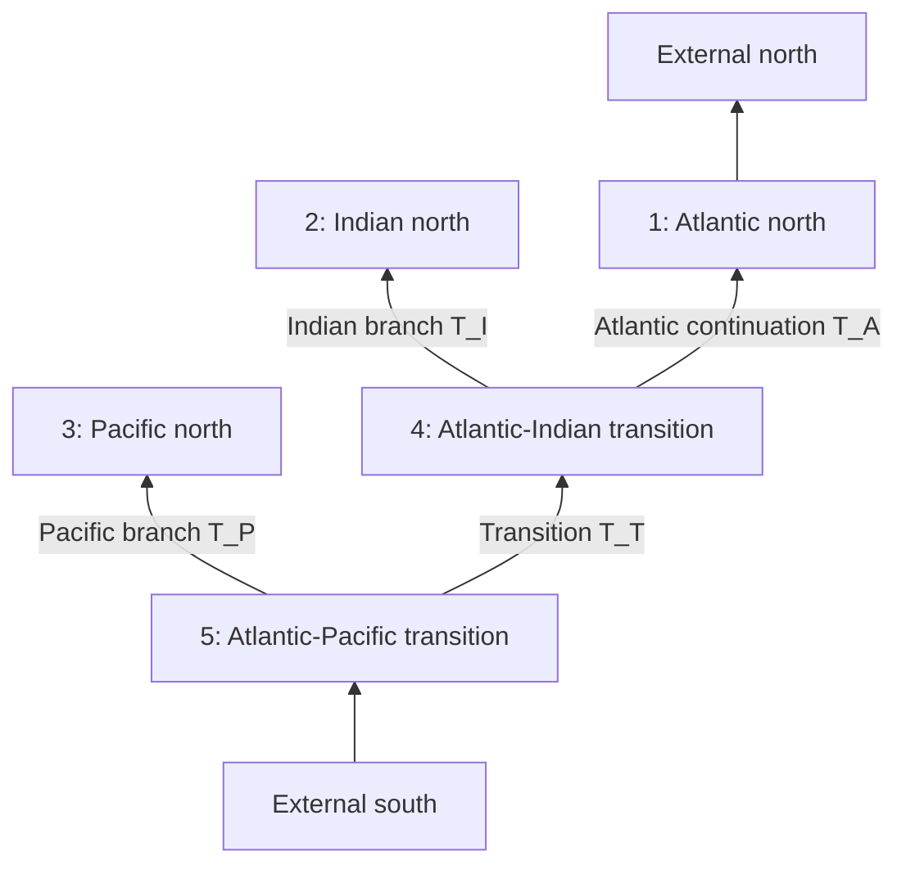

# Model architecture specification

Status: proposed architecture for review. This document specifies interfaces,
equations, invariants, and acceptance tests; it does not authorize scientific
implementation yet.

## 1. Scope and design stance

The first scientific release will support two deliberate model facades:

1. `GlobalModel`, representing the five dynamical sectors in the
   non-Indonesian-Throughflow derivation.
2. `AtlanticModel`, representing the single Atlantic region from Cape
   Agulhas to the northern observing line.

They will share geometry, wind, Fourier, regional `F`/`r`, solving, and
diagnostic components. They will not initially expose an unrestricted graph
compiler. The global graph is scientifically fixed enough that accepting
arbitrary topologies would add validation burden before there is a tested use
case. Internal graph objects will nevertheless make the five-region structure
explicit, preserve child order, and leave a path to later generalization.

The central separation is:

```text
source data -> validated geometry and forcing anomalies
            -> Fourier transform and regional F/r calculations
            -> model-specific linear system
            -> labelled time-domain solution and diagnostics
```

Geometry contains no forcing. Forcing contains no solved state. Model facades
own the model-specific equations and assemble them from the supplied forcing
prescriptions. The Fourier step transforms the common time record; the regional
step computes the wind-forcing term `F` and geometric response factor `r`; the
model step solves for the independent eastern-boundary thicknesses; and the
diagnostic step reconstructs transports and thicknesses before transforming
them back to time. Diagnostics derive from one solved state and the same
regional calculations used in the solve.

## 2. Terminology and sign conventions

These terms are normative.

- A **region** is one of the five latitude-bounded dynamical domains used by
  the global equations. The five regions are sectors of one connected model
  ocean.
- `x_b(y)` and `x_e(y)` are the isobath-derived western and eastern limits of
  the Rossby-wave interior. This project closes the theory with a negligibly
  narrow western-boundary-current (WBC) region, so it does not carry a separate
  western-wall coordinate.
- `h_e` is the eastern-boundary active-layer thickness anomaly.
- `h_b = h(x_b, y, t)` is the interior thickness immediately outside the WBC
  region, obtained from the Rossby-characteristic solution.
- `h_w` is the thickness at the western boundary inferred from geostrophic
  transport. It is not a "westward-propagating thickness."
- `T`, `T_g`, and `T_Ek` are total, geostrophic, and Ekman northward
  transports, respectively.
- Graph arrows and positive connection transports point northward.
- Longitude and latitude are degrees east and degrees north at public
  boundaries. Metric integrals use radians and spherical scale factors.
- The Fourier convention is NumPy's forward convention,
  `a_hat(omega) = integral a(t) exp(-i omega t) dt`; a delay `tau` therefore
  contributes `exp(-i omega tau)`.

The relations

$$
T = T_g + T_{Ek},
\qquad
T_g = \frac{g'H}{f}(h_e-h_w),
\qquad
h_w = h_e-\frac{fT_g}{g'H}
$$

must hold under the documented sign convention.

## 3. The non-ITF five-region model

Let the junction latitudes satisfy

$$y_S < y_P < y_I < y_N.$$

The initial release uses the documented latitude convention `y_S=-56`,
`y_P=-44`, `y_I=-35`, and `y_N=55` degrees north. A non-default geometry must
state different values explicitly; gateways are never inferred independently
for adjacent regions.

| ID | Public key | Latitude domain | Western trace | Eastern trace |
|---:|---|---|---|---|
| 1 | `atlantic_north` | `y_I` to `y_N` | Atlantic west | Atlantic east |
| 2 | `indian_north` | `y_I` to `y_NI` | Indian west | Indian east |
| 3 | `pacific_north` | `y_P` to `y_NP` | Pacific west | Pacific east |
| 4 | `atlantic_indian_transition` | `y_P` to `y_I` | Atlantic west | Indian east |
| 5 | `atlantic_pacific_transition` | `y_S` to `y_P` | Atlantic west | Pacific east |

Regions are views assembled from six shared physical traces, not five
independently extracted contours. The closed-basin convention is deterministic:
`y_NI` and `y_NP` are the northernmost sampled latitudes at or south of `y_N`
where both of that basin's boundary traces are finite. The selected latitude is
stored in the topology and used by both geometry and forcing calculations.

Each basin records requested southern and northern latitudes. The geometry
sampler first verifies that both `x_b` and `x_e` cover that interval, then maps
the boundaries to forcing-grid rows. At an internal gateway, the adjoining
basins must use one shared physical latitude and one shared sampled row;
otherwise validation fails. At an external northern or southern closure, the
sampled row may differ slightly from the requested latitude, and both values
are recorded. An internal gateway is never moved silently to accommodate a
particular bathymetry or wind grid.

### 3.1 Directed topology



The required east-to-west child orders are:

- region 5: `[pacific_north, atlantic_indian_transition]`;
- region 4: `[indian_north, atlantic_north]`.

The first child is the eastern child and shares its eastern-boundary thickness
with its parent. Consequently there are three independent eastern-boundary
unknowns:

- `h_A` for region 1;
- `h_I` shared by regions 2 and 4;
- `h_P` shared by regions 3 and 5.

The decomposed branch transports are

$$
T_I=T_{I,Ek}+\kappa_I(h_I-h_A),
\qquad
T_P=T_{P,Ek}+\kappa_P(h_P-h_I),
$$

where

$$
\kappa_I=\frac{g'H}{f(y_I)},
\qquad
\kappa_P=\frac{g'H}{f(y_P)}.
$$

The signed Coriolis parameter is required; replacing it with `abs(f)` is an
error. `T_A` and `T_T` are auxiliary continuation transports determined by
regional volume budgets.

Region 1 has the prescribed northern transport. Regions 2 and 3 have solid
northern boundaries. The global southern transport is wind-driven in the
model formulation.

### 3.2 Atlantic view

The initial package does not attempt to define a generic `PhysicalOcean`
abstraction. For this project, an ocean is identified by its eastern boundary,
and the only cross-region ocean diagnostic required initially is the Atlantic.
Its eastern boundary follows the ordered sectors

```text
atlantic_pacific_transition -> atlantic_indian_transition -> atlantic_north
```

with branch junctions at `y_P` and `y_I`. A small `AtlanticView` references
those regions and the solved connection transports; it does not duplicate
state or interpolate across a gateway. Regions 2 and 3 remain available as
regional Indian and Pacific diagnostics. A generic union of regions into
additional named oceans is outside the initial implementation.

## 4. Atlantic model

The Atlantic facade uses one region, normally from `-35` to `55` degrees
north, with Atlantic `x_b(y)` and `x_e(y)` throughout. It has no
step changes and no Indian or Pacific branch transports. Its southern closure
is

$$
h_w(y_S,t)=0,
\qquad
T_{g,S}(t)=\frac{g'H}{f_S}h_e(t).
$$

This is the boundary condition from which the scalar system in Section 8.2 is
derived; it is not a global-model southern closure applied to one graph node.

It reuses the same trace objects, model parameters, wind calculations, Fourier
plan, and diagnostics as the global model. It has a distinct southern closure
and therefore a distinct model-specific linear system; it should not be
implemented by constructing a malformed one-node instance of the global
five-region equations.

The public configuration switch should be explicit:

```python
global_model = GlobalModel(
    topology=global_topology,
    reduced_gravity=g_prime,
    reference_density=rho0,
    layer_depth=H,
)
atlantic_model = AtlanticModel(
    basin=global_topology.basin("atlantic_north"),
    reduced_gravity=g_prime,
    reference_density=rho0,
    layer_depth=H,
)
```

There is no separate `physics` object in the initial API. The small set of
required scalar parameters is supplied directly to each model; a shared
configuration helper can be introduced later if repeated use warrants it.

## 5. Public forcing contract

### 5.1 Wind input is wind-stress anomaly

The public wind forcing is the pair of wind-stress anomalies
`tau_x_prime(time, latitude, longitude)` and
`tau_y_prime(time, latitude, longitude)`, not `w_Ek`.

A `WindStressAnomaly` validates:

- a common, strictly increasing time coordinate;
- one-dimensional latitude and longitude coordinates with an explicit
  convention. Input may be a cyclic global grid or a monotone unwrapped grid
  that covers the geometry; the wind calculation normalizes it to a declared
  continuous working frame;
- dimensions and finite values;
- dynamic stress units (`N m-2`);
- provenance describing how the anomaly was formed, the source record, and
  interpolation.

The object already contains anomalies; the model does not remove another mean.
Data adapters are responsible for placing all forcing anomalies on the exact
common model interval before constructing the forcing objects. For a
SCOTIA/ERA5 experiment, the adapter removes each source's mean over that common
record while retaining the seasonal cycle. Precomputed `w_Ek` may be accepted
only as an internal cache or advanced low-level input; it is not the primary
user interface.

The wind calculation converts dynamic stress to kinematic stress internally,
using the reference density supplied to `GlobalModel` or `AtlanticModel`
together with the reduced gravity and layer depth:

$$
\boldsymbol\tau'_k=\boldsymbol\tau'_{dynamic}/\rho_0.
$$

All equations below use `tau_k` and therefore contain no further factor of
`rho0`. Kinematic stress is not accepted at the public input boundary. The
converted field and original units are both recorded so density cannot be
applied twice.

The wind calculation derives, with one shared regularization,

$$
I_\gamma(f)=\frac{f}{f^2+\gamma^2},
$$

$$
\mathbf M'_{Ek}
=\left(
\tau'_{k,y} I_\gamma,
-\tau'_{k,x} I_\gamma
\right),
\qquad
w'_{Ek}=\nabla\cdot\mathbf M'_{Ek},
$$

and

$$
T'_{Ek}(y)
=-\int_{x_b}^{x_e}\tau'_{k,x} I_\gamma\,dx.
$$

Section transport, local Ekman transport, and the Rossby-interior calculation
all use `x_b` to `x_e`, consistently with the thin-WBC closure adopted by this
project.

Spatial stress tapering is disabled by default. If explicitly enabled, a
raised-cosine taper with a default width of 2 degrees takes stress to zero on
solid lateral sidewalls and on the closed northern boundaries of the Indian
and Pacific before the curl is taken. On a sampled forcing grid, the northern
taper reaches zero at the last included latitude row rather than requiring the
physical closure latitude to be an exact coordinate. The choice and width are
recorded. In either case, the three step-shaped Atlantic regions are
differentiated separately so that mask discontinuities do not create
artificial wind-curl sheets.

### 5.2 Independent regional forcing

`BasinForcingSet` contains one replaceable wind-stress prescription for each
of the five global regions. A region may:

- use the default geometry-masked view of one global stress field;
- use a separate stress dataset;
- be scaled for a sensitivity experiment;
- be explicitly set to zero.

The absence of a region prescription is an error unless a named default policy
fills it. This prevents an omitted forcing from being silently treated as
zero. Region masks and tapers belong to the wind configuration, not
to the raw stress data.

Regional replaceability does not permit two values for one shared gateway.
Before `F` and `r` are evaluated, the forcing set constructs one canonical
composite wind field. The default field owns all interfaces. If separate
regional datasets or scalings are supplied, the configuration must either:

1. name the region that owns each gateway value; or
2. demonstrate that both prescriptions agree there within a declared
   tolerance after interpolation, conversion, optional tapering, and
   regularization.

For the fixed graph, the Indian and Pacific branch-section Ekman transports
are computed once from their northern child-ocean views and reused by every
equation touching that gateway. Incompatible parent and child values are an
error, never averaged silently. This preserves a unique `T_I,Ek` and
`T_P,Ek`.

The discrete wind calculation must also satisfy, for each region and using the
same grid, mask, metric, taper choice, and regularization,

$$
\int_{y_S}^{y_N}\int_{x_b}^{x_e}w_{Ek,j}\,dx\,dy
=T_{Ek,j}(y_N)-T_{Ek,j}(y_S)
$$

to numerical tolerance. This is the discrete divergence theorem applied to
the same section transports used in the regional volume budget; no auxiliary
public integral types are introduced.

The default northern prescription is total transport; the Atlantic example
uses the SCOTIA total transport. A directly specified geostrophic or Ekman
series may be supplied for a named decomposition experiment, but the model
never infers geostrophic transport by subtracting an ERA5 Ekman estimate from
total transport. Components and signs are recorded in output metadata, and no
unlabelled residual transport is exposed. ERA5 northern Ekman transport may be
diagnosed but is not dynamically substituted for the prescribed northern
transport.

`AtlanticModel` accepts one Atlantic stress prescription and the Atlantic
northern transport. It rejects five-region keys rather than ignoring them.
The two facades may share forcing value objects, but they do not pretend to
have identical forcing schemas.

## 6. Time and Fourier plan

A `FourierPlan` owns all temporal preprocessing so every forcing uses exactly
the same convention:

1. require forcing objects that already share one uniform time axis and already
   contain anomalies formed over that common interval;
2. treat every anomaly as exactly zero outside the common record;
3. add at least `n-1` zeros before and after an `n`-sample record;
4. choose `n_fft >= 3n-2`, with optional additional zero padding;
5. use `omega = 2*pi*rfftfreq(n_fft, d=dt)`;
6. solve nonnegative frequencies;
7. set the zero-frequency anomaly solution to exactly zero;
8. reconstruct with `irfft`, crop the original central interval, and remove
   only floating-point residual means.

Zero extension and cropping prevent the periodic FFT assumption from connecting
the first and last observations directly and state the intended forcing outside
the observed interval. The plan records original and padded indices, cadence,
zero-padding lengths, `n_fft`, and frequency units. Reflection is not used.

The Nyquist policy must be explicit. Both even and odd padded lengths are
allowed. An even-length plan must prove that the standalone real-valued
Nyquist coefficient and response calculation preserve a real inverse transform;
the coefficient must not be silently dropped. The padded length may have either
parity.

## 7. Regional `F` and `r` terms

The shared interior dynamics are

$$
\partial_t h-c(y)\partial_xh=-w_{Ek},
\qquad
c(y)=\min\left(\frac{\beta g'H}{f^2},
\frac{\sqrt{g'H}}{3}\right).
$$

Let `phi_c` be the latitude where the uncapped Rossby speed first reaches the
gravity-wave cap. The initial computational convention is
`gamma = abs(f(phi_c))`. This is the default needed for a working equatorial
calculation, but remains scientifically provisional: issue #7 must justify or
replace it. All runs record `phi_c`, `gamma`, and the regularization formula.
For canonical kinematic stress on a sphere,

$$
w'_{Ek}=\frac{1}{R\cos\phi}
\left[
\frac{\partial}{\partial\lambda}
\left(\tau'_{k,y}I_\gamma\right)
-\frac{\partial}{\partial\phi}
\left(\tau'_{k,x}I_\gamma\cos\phi\right)
\right].
$$

The discrete implementation is tested against this expression, including the
metric factors; a Cartesian curl is not an interchangeable approximation.

For region `j`, let

$$
L_j(y)=x_e^{(j)}(y)-x_b^{(j)}(y)>0,
$$

and let `c(y)>0` denote the magnitude of westward long-Rossby-wave speed. Define

$$
P_j(\omega,x,y)
=1-e^{-i\omega(x-x_b^{(j)})/c},
$$

$$
F_j=-\int_{y_{Sj}}^{y_{Nj}}\left[
\int_{x_b}^{x_e}P_j\widehat w_{Ek,j}\,dx
\right]dy,
$$

$$
r_j=-\int_{y_{Sj}}^{y_{Nj}}
cP_j(\omega,x_e^{(j)},y)\,dy.
$$

This is the thin-WBC form used by the project. A finite-width WBC correction is
outside the initial theory and would require a later specification.

Each regional budget is

$$
T_{out}^{(j)}-T_{in}^{(j)}=-F_j+r_jh_e^{(j)}.
$$

Units are part of the calculation contract:

- `F`: `m3 s-1`;
- `r` and `kappa`: `m2 s-1`;
- `h_e`: `m`;
- `r*h_e` and `kappa*h_e`: `m3 s-1`.

Partial north-of-latitude integrals are computed by the same calculation and
cached for transport diagnostics. They are not independently reimplemented in
plotting code.

## 8. Model equation systems

### 8.1 Global system

The seven unknowns are

$$
(h_A,h_I,h_P,T_A,T_T,T_I,T_P).
$$

Five regional budgets and the two branch decompositions give seven equations.
After eliminating transports, the three-thickness system is

$$
\begin{pmatrix}
r_1+\kappa_I&r_4+\kappa_P-\kappa_I&r_5-\kappa_P\\
-\kappa_I&r_2+\kappa_I&0\\
0&-\kappa_P&r_3+\kappa_P
\end{pmatrix}
\begin{pmatrix}h_A\\h_I\\h_P\end{pmatrix}
=
\begin{pmatrix}
F_1+F_4+F_5+T_N+T_{I,Ek}+T_{P,Ek}-T_S\\
F_2-T_{I,Ek}\\
F_3-T_{P,Ek}
\end{pmatrix}.
$$

The implementation solves this explicit three-by-three system at each
frequency, reports rank and condition number, and reconstructs the four
connection transports afterward. It must reproduce the displayed matrix up to
a declared permutation. Independent acceptance evaluates the solved state
against the separately assembled seven unreduced regional-budget and
branch-decomposition residuals. A generic equation compiler and a second
auxiliary formulation are unnecessary for the initial fixed model.

### 8.2 Atlantic system

For the Atlantic region, the total-transport budget is

$$
T_N-T_S=-F+r h_e.
$$

The southern closure `h_w(y_S)=0` gives

$$
T_S=T_{Ek,S}+\frac{g'H}{f_S}h_e.
$$

Therefore the scalar system is

$$
\left(r+\frac{g'H}{f_S}\right)h_e
=F+T_N-T_{Ek,S}.
$$

`AtlanticModel` solves this scalar equation directly rather than routing
through the global three-thickness matrix.

## 9. Diagnostics and solution contract

The interior characteristic solution is

$$
\widehat h(x,y)
=\widehat h_e e^{i\omega(x-x_e)/c}
+\int_{x_e}^{x}\frac{\widehat w_{Ek}(x')}{c}
e^{i\omega(x-x')/c}\,dx'.
$$

At the interior edge of the WBC region,

$$
\widehat h_b
=\widehat h_e e^{-i\omega L/c}
-\frac{1}{c}\int_{x_b}^{x_e}\widehat w_{Ek}(x')
e^{-i\omega(x'-x_b)/c}\,dx'.
$$

For the global Atlantic path, the applicable eastern thickness is

$$
h_e^*(y)=
\begin{cases}
h_A,&y\ge y_I,\\
h_I,&y_P\le y<y_I,\\
h_P,&y<y_P.
\end{cases}
$$

For any region `j`, define `F_{j,\ge y}` and `r_{j,\ge y}` by using `y` as the
southern limit in the Section 7 definitions. The total transport at latitude
`y` follows directly from the partial regional budget:

$$
T_j(y)=T_{j,N}+F_{j,\ge y}-r_{j,\ge y}h_e^{(j)}.
$$

For the global Atlantic view, this equation is evaluated piecewise in regions
1, 4, and 5. The solved graph transport at each gateway supplies the northern
value for the next sector, so no interpolation or ad hoc jump is introduced.
The branch geostrophic transports remain

$$
T_{I,g}=\kappa_I(h_I-h_A),
\qquad
T_{P,g}=\kappa_P(h_P-h_I).
$$

For regions 2 and 3, `T_{j,N}=0` at the closed northern boundary, with
`h_e^(2)=h_I` and `h_e^(3)=h_P`. Their regional transports, `h_b`, and `h_w`
follow from the same equations. They are not extended through the composite
southern sectors as generic named oceans.

`AdjustmentSolution` returns labelled `xarray` objects containing at least:

- `h_e(time, independent_boundary)`;
- `edge_transport(time, connection, component)`, where `component` is exactly
  `total`, `geostrophic`, or `ekman`;
- `h_b(time, region, latitude)`;
- `h_w(time, view, latitude)`;
- `transport_geostrophic(time, view, latitude)`;
- `transport_ekman(time, view, latitude)`;
- `transport_total(time, view, latitude)`;
- frequency, rank, condition number, and residual diagnostics;
- named forcing contributions when a decomposition solve is requested.

The `F/r` regional budgets conserve the `total` edge component. Geostrophic and
Ekman components are named diagnostics, with `total = geostrophic + ekman`
enforced wherever all three are reported. No unlabelled graph transport is
exposed.

Full interior thickness is an on-demand diagnostic rather than an eagerly
stored solution variable. `AdjustmentSolution.interior_thickness(...)`
evaluates the characteristic equation on requested region/latitude/longitude
coordinates from the retained spectra and Fourier plan. This avoids forcing a
four-dimensional field into every result while preserving the scientific
capability.

Results record physical parameters, geometry/configuration hashes, source
provenance, anomaly period, Fourier plan, regularization, tapering, units, and
sign conventions. A forcing-decomposition result must close exactly: the sum
of its named linear contributions equals the full solution to numerical
tolerance.

Saved scientific output is the full unfiltered anomaly solution. A zero-phase
Butterworth low-pass filter may be applied by plotting/example code for a
declared cutoff, but it creates a derived presentation variable and never
replaces solved state. Transport comparison plots use one common symmetric
colour normalization for geostrophic, Ekman, and total components when those
panels are intended for direct comparison.

## 10. Minimal public surface

| Object | Responsibility |
|---|---|
| `Basin` | One sector's `x_b`, `x_e`, northern and southern limits, and named inflows/outflows |
| `MultiBasinTopology` | The five basins, fixed connections, east-to-west child order, and shared eastern boundaries |
| `WindStressAnomaly` | Dynamic `tau_x_prime` and `tau_y_prime` on the common time record |
| `BasinForcingSet` | Per-basin wind prescriptions and typed boundary transports |
| `GlobalModel` | Compute `w_Ek`, `T_Ek`, `F`, and `r`; assemble and solve the fixed global system |
| `AtlanticModel` | Apply the same calculations to the scalar Atlantic closure |
| `AdjustmentSolution` | Labelled thicknesses, transports, residuals, forcing contributions, and provenance |

`AtlanticView` may be a small solution helper for the piecewise diagnostic in
Section 9; it need not be a general ocean class. Time alignment, geometry
sampling, Fourier transforms, and partial `F`/`r` integrals are implementation
functions unless a repeated use case later justifies a public object. There is
no public `Physics`, `Port`, `EquationCompiler`, gateway-view, or generic
physical-ocean abstraction.

## 11. Required validation

Before scientific release, tests must establish that:

- the five basin keys, graph connections, child order, and shared eastern
  boundaries match Section 3 exactly;
- every sampled basin has finite `x_b` and `x_e`, with `x_e > x_b`, and every
  internal gateway has one physical latitude and one sampled row;
- wind inputs are dynamic-stress anomalies on one uniform common record;
- tapering-on and tapering-off paths are both tested, and differentiating the
  step-shaped masks does not create spurious curl sheets;
- the area integral of `w_Ek` equals the change in section `T_Ek` for every
  basin when computed with the same grid and regularization;
- zero extension prevents an end-to-start FFT arrival, the inverse transform is
  real, zero forcing gives zero response, and linear superposition holds;
- the assembled global matrix matches Section 8 and the solution closes all
  seven unreduced equations independently;
- the Atlantic scalar solve satisfies both its northern prescription and
  southern closure;
- all regional volume budgets close, graph transports are conservative, and
  `T = T_g + T_Ek` wherever components are reported;
- `h_b` is the characteristic solution at `x_b`, `h_w` follows from geostrophic
  transport, and the Atlantic diagnostic uses the correct gateway transports.

Failures report the affected basin, frequency or period, matrix condition, and
scaled residual; no missing forcing, singular frequency, or component mismatch
is filled or relabelled silently.

## 12. Fixed initial conventions

The first implementation uses one compact set of defaults for both model
facades:

| Quantity | Convention |
|---|---|
| Active-layer and contour depth | one shared `H = isobath_depth = 1000 m` parameter |
| Reduced gravity | `g_prime = 0.02 m s-2` |
| Reference density | `rho0 = 1027 kg m-3` |
| Junctions and Atlantic limits | `y_S=-56`, `y_P=-44`, `y_I=-35`, `y_N=55` degrees north |
| Closed Indian/Pacific north | northernmost common finite boundary row at or south of `y_N` |
| Northern forcing | directly prescribed total transport; SCOTIA for the Atlantic example |
| Wind-stress taper | off; optional raised-cosine width of 2 degrees when enabled |
| Equatorial regularization | `gamma = abs(f(phi_c))`, recorded and provisional |
| Global topology | the fixed non-ITF graph in Section 3 |

`H` and isobath depth are the same quantity, not independently adjustable
parameters. A run may override a default only by recording the new value in
its configuration and output. The regularization is the sole convention still
awaiting scientific justification, tracked in
[issue #7](https://github.com/andrewwatford/MOCAdjustmentTheory/issues/7); that
issue does not block the fixed initial implementation.
